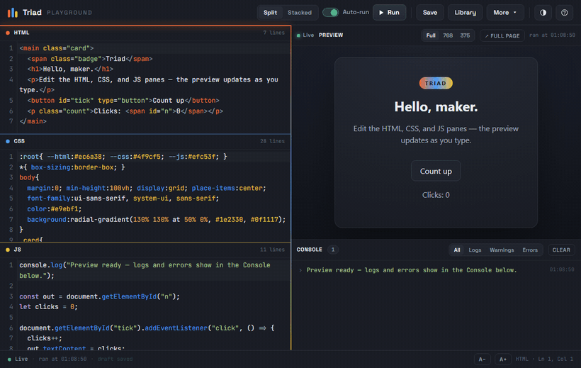

# Triad

Triad is a local HTML, CSS, and JavaScript playground that runs entirely in your browser. You
write code in three editors and see the result render live, with a console that captures logs and
runtime errors. There is no account, no server, and nothing is uploaded anywhere.

Live demo: https://archie0099.github.io/Triad/



## Features

- **Three editors:** HTML, CSS, and JavaScript with syntax highlighting, line numbers, bracket and
  tag matching, and in-editor find.
- **Live preview:** the result re-renders as you type (debounced) or on demand, with an auto-run
  toggle and a full-page pop-out.
- **Console:** captures log, info, warn, error, and table output plus uncaught errors and promise
  rejections. Objects and arrays are expandable, an error with a line number jumps to that line in
  the editor, and any row can be copied. Level filters and duplicate collapsing keep it readable.
- **Command palette:** press Ctrl/Cmd P to search and run any action by name.
- **Pen library:** save, load, rename, duplicate, delete, and search snippets, all stored locally
  in your browser.
- **Export and import:** save a pen as a standalone .html file and load it back later.
- **Image embedding:** drag an image onto an editor to embed it as a data URL.
- **Themes and layout:** light and dark themes that follow your system by default, split and
  stacked layouts with a draggable divider, and Full, 768, and 375 pixel preview widths.
- **Offline and installable:** after one load over http it works with no network, and an Install
  button appears where the browser supports it.

## Getting started

Open index.html in a browser, either by double-clicking it or dragging it into a window. Keep the
folder together, since index.html loads the other files from inside it. Your saved pens and
settings are remembered between visits.

To make it installable and cached for full offline use, serve the folder over http instead of
opening the file directly. From inside the folder, run any one of these and open the printed URL:

```bash
python3 -m http.server 8080
npx serve .
php -S localhost:8080
```

## How it works

No framework, no build step, and no backend. The three editors use CodeMirror, vendored locally so
the app has no network dependency. Your code is assembled into a sandboxed iframe that re-runs on
each change; a small script injected ahead of your code mirrors console output and runtime errors
back to the panel. Saved pens, the working draft, and preferences live in localStorage, so your
data never leaves the browser. A service worker precaches the app for offline use when it is served
over http.

## Tests

There is nothing to build, but you can check the code without a browser:

```bash
node test/verify.js
```

It runs syntax checks, confirms the markup wiring is intact, boots the app against stubbed browser
APIs, and runs a suite of behavioral tests in test/behavior.js that exercise the console serializer,
escaping, and storage logic. It prints a result per check and exits non-zero on any failure.

## Keyboard shortcuts

| Action | Keys |
| --- | --- |
| Run preview | Ctrl/Cmd Enter |
| Save pen | Ctrl/Cmd S |
| Open library | Ctrl/Cmd O |
| Command palette | Ctrl/Cmd P |
| Clear console | Ctrl/Cmd K |
| Find in editor | Ctrl/Cmd F |
| Show shortcuts | ? |

## Credits

The editor is CodeMirror 5 (MIT), included under vendor/ with its license.
